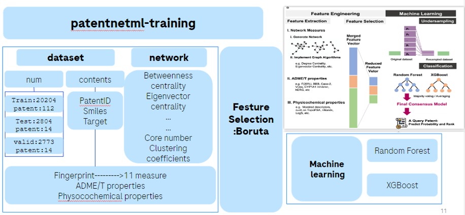
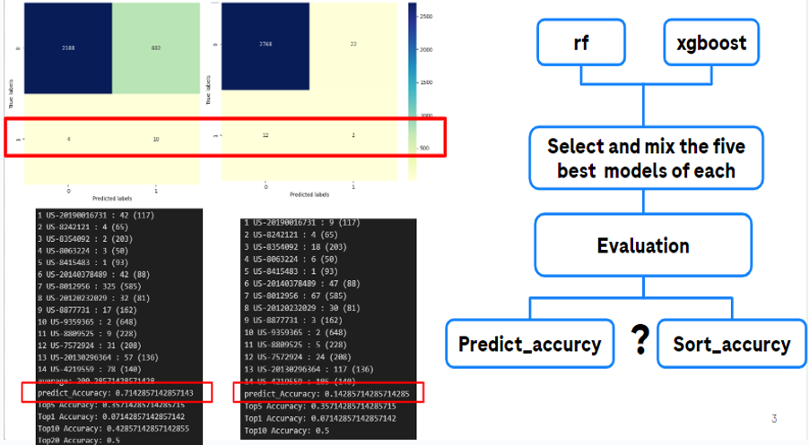
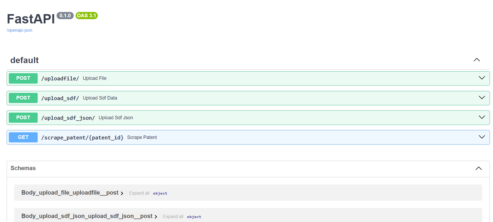
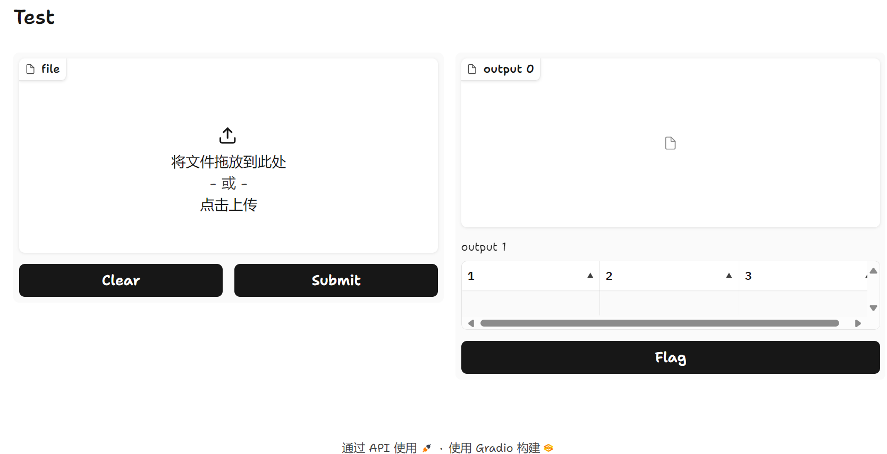

# Patent-LeaDiD
### Introduction
本项目，是基于Network+Boruta+ML实现对于pantent中关键化合物的提取，。
### principle

### Performance
eval score:

### Usage
Clone and download requirements
```
git clone this repo
conda create -n lcidentify python==3.10
cd lcidentify
pip install -r requirements.txt
```
sh to start

```
./test.sh
```
and then go to [loaclhost:8080/docs]() to use the fastapi

 or go to [loaclhost:7860]() to use the gradio ui which only combine  
 
#### docker
use dockerfile to start or use docker-compose to build 

```
####dockerfile
docker build -t LeaDiD:latest .
docker run -p 1111:8000 -p 11111:7860 -it --name LeaDiD LeaDiD:latest

### docker-compose

docker-compose up -d --build

```

### fast_api
api

"/uploadfile/":use for upload csv files for patent smiles

"/upload_sdf/":use for process sdf data

"/upload_sdf_json/":transform sdf to json

"/scrape_patent/{patent_id}":scrape patent information
### train
#### prepare the data
download date from
https://drive.google.com/drive/folders/13dpqXqfmAzZPexjlKE8yxfs8ot8TLX3s?usp=sharing

install the requirements.txt from ./train

run the ./train/train_test.py for training
